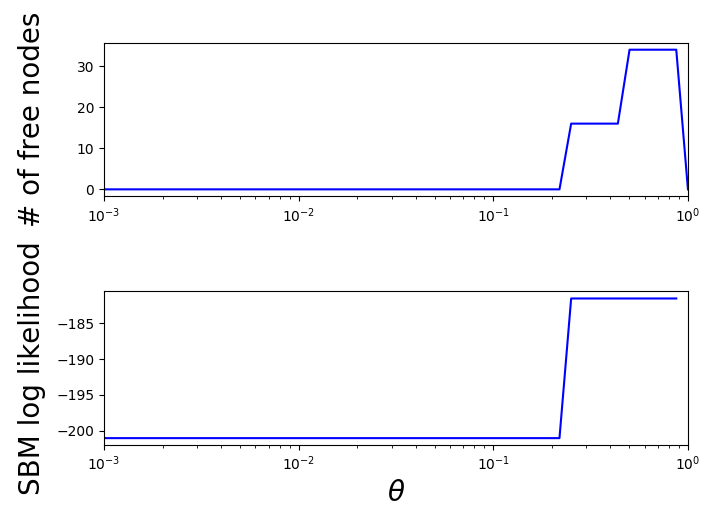
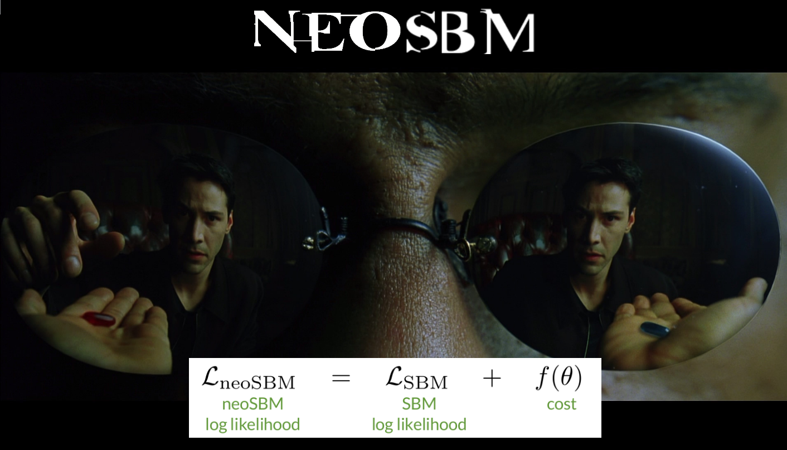

# neoSBM
A new type of SBM<sup>[1](#paperreference)</sup>

For details on usage run:
```
python runNeoSBM.py -h 
```

This repository includes [Zachary's karate club](https://en.wikipedia.org/wiki/Zachary%27s_karate_club) dataset in the files `karate.txt` and `karate_faction.txt`.
Use the following command to run NeoSBM on this dataset.

```
python runNeoSBM.py "karate.txt" "karate_faction.txt" -3 -o "myoutput.txt"
```

## Displaying the output

To produce the graph of log likelihoods as a function of theta (as Fig. 4C in the paper), run the following from the python terminal

```
>>> import disp_output as do
>>> do.plotLq('karate','karate_faction')
```

To produce the following



# Installing a Python 2.7 environment using conda

neoSBM is written using Python 2.7.  If you attempt to run the usage command above using Python 3, you will receive the following error message

```
python runNeoSBM.py -h 


  File "runNeoSBM.py", line 49
    print '\n\n'
               ^
SyntaxError: Missing parentheses in call to 'print'. Did you mean print('\n\n')?
```

One way to install a Python 2.7 environment without modifying your system Python is to install the free [miniconda installer](https://docs.conda.io/en/latest/miniconda.html).

Once miniconda has been installed, create an environment for neoSBM using the following command in bash (Linux/Mac) or cmd.exe (Windows)

```
conda create -n neoSBM python=2.7 numpy scipy
```

Switch to this environment using the command

```
conda activate neoSBM
```

It should now be possible to run neoSBM from this command prompt.  You can go back to the system version of Python when you are finished with

```
conda deactivate
```

# Reference

<a name="paperreference">1</a>. Peel, Larremore & Clauset, The ground truth about metadata and community detection in networks, _Science Advances_ 2017 
https://advances.sciencemag.org/content/3/5/e1602548


